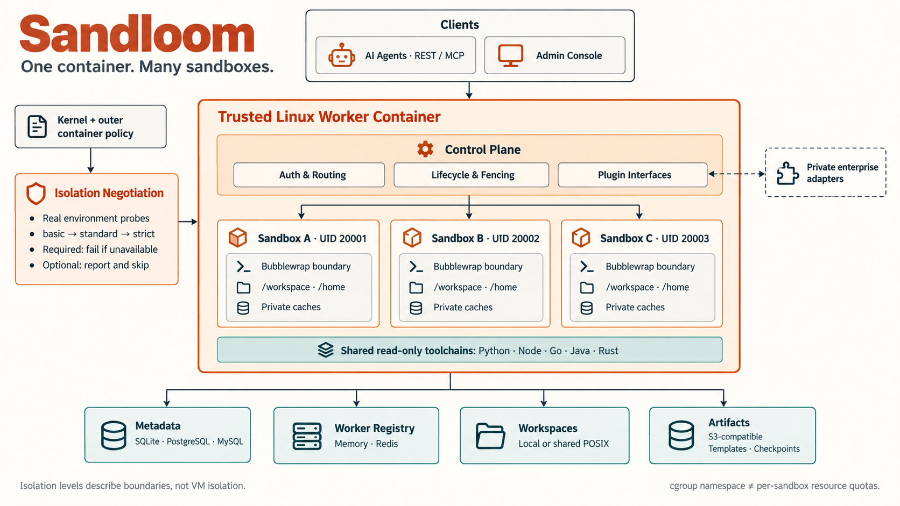
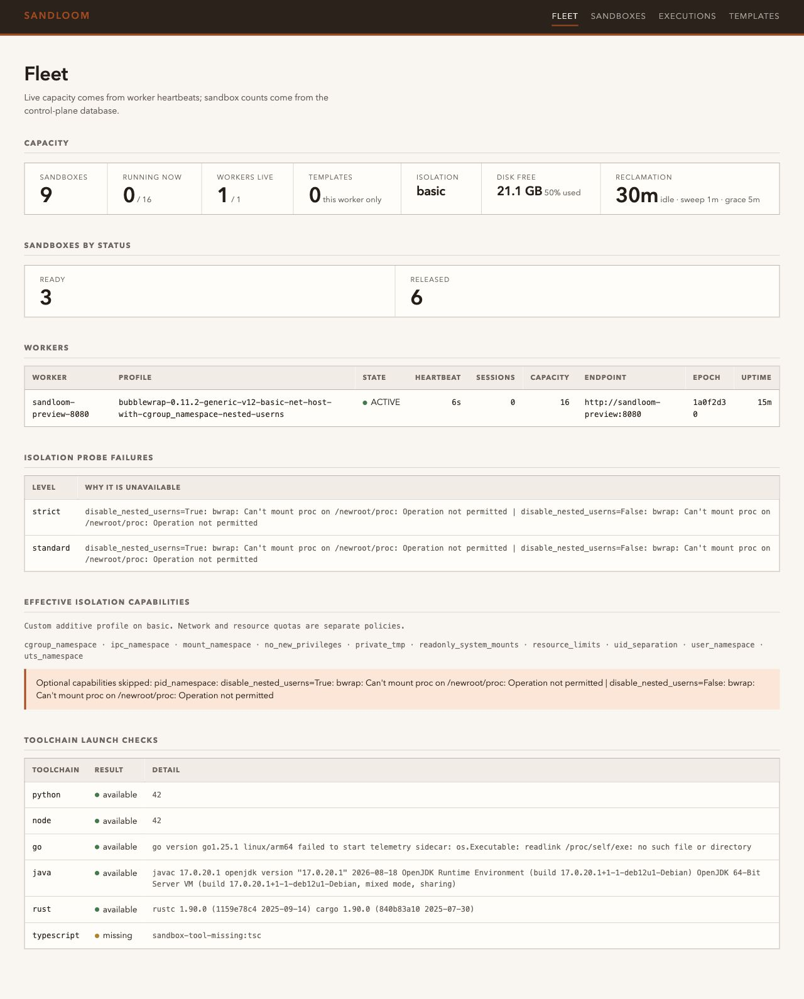

# Sandloom（沙织）

English | [简体中文](README.zh-CN.md)

*One container. Many sandboxes.*

Sandloom is a high-density execution service for AI agents. One trusted
worker container hosts many isolated, persistent workspaces instead of paying
the startup and memory cost of one container per agent.

Each sandbox gets its own Linux UID, writable workspace, home, package caches,
resource limits, and Bubblewrap namespaces. The control plane provides sticky
routing, generation fencing, idempotent execution, idle reclamation, and an
HTTP/MCP API.

Start with [Deployment](docs/DEPLOYMENT.md) for prerequisites and middleware,
or [Environment diagnosis](docs/ENVIRONMENT_DIAGNOSTICS.md) to have an Agent
inspect your worker and propose an operator-approved isolation profile.



The diagram shows the built-in Linux/Bubblewrap backend. Namespaces and
per-process limits are not aggregate per-sandbox resource quotas; an S3 archive
is not a live workspace filesystem.

> Status: beta. The service has strong protection against accidental cross-
> workspace access. Treat `basic` and `standard` as defense-in-depth inside a
> trusted worker; validate `strict` against your threat model before using it
> for hostile public multi-tenancy.

## Why this exists

Container-per-agent designs waste resources when thousands of agents are idle
or only need short command executions. Sandloom amortizes the heavyweight
container and toolchain while keeping workspace ownership and the selected
namespace boundaries separate:

```text
outer worker container
├── control plane + scheduler
├── sandbox A: UID 20001 + Bubblewrap + /workspace
├── sandbox B: UID 20002 + Bubblewrap + /workspace
└── sandbox C: UID 20003 + Bubblewrap + /workspace
```

The design is related to [Cloudflare Computer](https://blog.cloudflare.com/cloudflare-computer/):
both separate an agent's durable workspace from execution and avoid assigning
a full container to every operation. Cloudflare dynamically chooses between a
lightweight isolate and a container over one virtual filesystem. This project
currently provides a Bubblewrap backend over POSIX workspaces, with an
execution-backend SPI for isolate, VM, or remote backends. See
[Architecture](docs/ARCHITECTURE.md) for the detailed comparison.

## Features

- Many agent sandboxes in one worker container.
- Persistent per-sandbox workspace, home, environment, and package caches.
- Automatic Bubblewrap capability probing with `basic`, `standard`, and
  `strict` isolation levels.
- Additive required/optional capabilities and a machine-readable local doctor
  for heterogeneous worker environments; no silent baseline weakening.
- Explicit network policy, kept separate from isolation strength.
- MySQL, PostgreSQL, or SQLite metadata through a portable SQLAlchemy adapter.
- In-memory or Redis worker discovery.
- An S3-compatible object store, on the standard AWS credential chain: what
  reusable environments cross workers on, and where a caller keeps checkpoint
  archives. Snapshot and restore are the caller's to orchestrate.
- Generation fencing so stale workers cannot mutate reassigned workspaces.
- REST and stateless Streamable HTTP MCP APIs.
- Reusable environment templates, built once and mounted read-only everywhere.
- A dependency-free fleet console at `/admin`: no build step, no CDN.
- Plugin entry points for metadata, registry, object storage, execution backends,
  credential brokers, and telemetry sinks.
- A strict public/private boundary: enterprise implementations ship only in a
  separately installed private package.

## Quick start

Bubblewrap requires Linux. On macOS or Windows, run the service in a Linux VM
or container.

```bash
cp .env.example .env
export SANDBOX_INTERNAL_TOKEN="$(openssl rand -base64 32)"
docker build -f Dockerfile.base -t agent-sandbox-base:latest .
docker compose up --build
```

`.env` is passed into the container, so every setting in it takes effect. The
few values the Compose file has to own — the token and the paths backed by the
named volume — are set in its `environment:` block, which wins over the file.

The default setup uses SQLite, an in-process worker registry, and a named
volume. It is intended for one service replica. The Compose file disables the
outer container's default seccomp profile because that profile blocks the
nested namespace syscalls Bubblewrap requires. A deployment that leaves the
profile in place does not degrade to a weaker boundary — the probe finds no
usable isolation level at all and the service exits at startup, which is what a
Kubernetes pod with the default `RuntimeDefault` profile will do. The manager process is trusted;
agent commands remain inside the negotiated Bubblewrap boundary. This does not
grant privileged mode or additional Linux capabilities. Check readiness:

```bash
curl http://127.0.0.1:8080/healthz
```

The response reports the level the probe actually negotiated. On Docker Desktop
and OrbStack this is usually `basic`: the outer runtime masks paths under
`/proc`, so `standard` cannot mount a private procfs, and `probe_failures` in
`/healthz` says exactly that. Unmasking them reaches `strict` on the same host:

```yaml
# compose.override.yaml — read docs/ISOLATION.md before adopting this.
services:
  agent-sandbox:
    security_opt: !override
      - seccomp=unconfined
      - systempaths=unconfined
```

That widens what the trusted manager container can see, so decide it
deliberately rather than assuming the quick start already gives you the
strongest boundary. See [Isolation](docs/ISOLATION.md).

For a multi-replica deployment, use PostgreSQL or MySQL, Redis, and either a
shared RWX POSIX workspace or explicit checkpoint/restore orchestration.

## Using it

`examples/quickstart.py` walks the whole lifecycle once — resolve, connect,
execute, write, list, move, delete, release — with no third-party imports:

```bash
export SANDBOX_INTERNAL_TOKEN=...   # the value the service was started with
python examples/quickstart.py
```

It prints what it did at each step, so read it top to bottom; every call it
makes is a call your own client will make. A failed run releases its sandbox
before exiting, so an experiment cannot leave one behind.

`examples/templates.py` does the same for environment templates — build a
virtualenv in one sandbox, publish it, mount it into a second sandbox that built
nothing, and check the mount is read-only:

```bash
python examples/templates.py
```

Both examples run against every deployment the project verifies, so neither can
drift away from the API it documents.

`scripts/verify-deployment.py` asserts the same surface and more — the
lifecycle, the file API, templates, the MCP toolset driven end to end, the
console's API, and a compile-and-run in every enabled language through both a
login and a plain shell. It needs nothing
installed and no privileges beyond the token, so it is the check to run against
a deployment you did not build yourself:

```bash
export SANDBOX_INTERNAL_TOKEN=...
./scripts/verify-deployment.py --base-url http://10.0.0.7:8080 --strict
```

## Isolation levels

Set `SANDBOX_ISOLATION_LEVEL=auto|basic|standard|strict`. Startup runs real
commands at every level; `auto` selects the strongest level the kernel and
outer container actually permit. An explicitly requested level fails startup
if unavailable and never silently weakens the boundary.

| Level | Added boundary | Typical external requirement |
| --- | --- | --- |
| `basic` | UID drop, `no_new_privs`, resource limits, user/mount/IPC/UTS namespaces, read-only system mounts, private `/tmp` | user namespaces and Bubblewrap allowed |
| `standard` | `basic` + PID namespace + private procfs | PID namespace and proc mount allowed by container policy |
| `strict` | `standard` + cgroup namespace | cgroup namespace allowed by kernel/runtime policy |

`SANDBOX_NETWORK_MODE=host` preserves egress. `isolated` adds a private network
namespace. Full prerequisites and downgrade behavior are in
[Isolation](docs/ISOLATION.md).

The current polyglot image supports Python, Node, Go, Java and Rust at
`basic`; image-owned Java/Rust launchers provide explicit library/sysroot
paths without mounting procfs. TypeScript uses Node and requires an installed
compiler/runner. Higher Levels add process isolation independently of language.
After selecting a Level, the worker launches the enabled tools in a temporary
sandbox and reports measured availability separately under
`worker.capabilities.toolchains.checks` in `/healthz`. A custom image can
therefore report different compatibility without changing the Level.
[Toolchains](docs/TOOLCHAINS.md) explains the checks and their limits.

Levels retain stable meanings. Where your environment supports a different
combination, you can request additions instead of redefining a Level:

```dotenv
SANDBOX_ISOLATION_LEVEL=basic
SANDBOX_ISOLATION_REQUIRED_FEATURES=cgroup_namespace
SANDBOX_ISOLATION_OPTIONAL_FEATURES=pid_namespace
```

Every combination is executed in a real probe. Required failures block startup;
optional failures are reported and skipped. PID isolation includes private
procfs. The resulting profile hash separates placement pools. Run
`docker compose run --rm --no-deps agent-sandbox python -m agent_sandbox.doctor --json`
before adoption; see [Environment diagnosis](docs/ENVIRONMENT_DIAGNOSTICS.md).

Do not grant the worker `--privileged`, mount the Docker socket, or add
`CAP_SYS_ADMIN` merely to make a probe pass. A failed probe is evidence that
the outer environment cannot safely provide that level.

## Storage and deployment adapters

| Concern | Built-in options | Selection |
| --- | --- | --- |
| Metadata | SQLite, MySQL, PostgreSQL | `SANDBOX_DATABASE_URL` |
| Worker registry | memory, Redis, private plugin | `SANDBOX_REGISTRY_BACKEND` |
| Workspace | local POSIX, shared RWX POSIX | `SANDBOX_LOCAL_ROOT` / `SANDBOX_SHARED_ROOT` |
| Checkpoints | S3-compatible object storage | `BLOBSTORE_*` |
| Execution | Bubblewrap, third-party plugin | `SANDBOX_EXECUTION_BACKEND` |

Examples:

```bash
# PostgreSQL
SANDBOX_DATABASE_URL=postgresql+asyncpg://user:pass@db/agent_sandbox
SANDBOX_DATABASE_AUTO_DDL=true

# MySQL
SANDBOX_DATABASE_URL=mysql+aiomysql://user:pass@db/agent_sandbox

# Multiple service replicas
SANDBOX_REGISTRY_BACKEND=redis
SANDBOX_REDIS_URL=redis://redis:6379/0
```

SQLite is the default and runs in WAL mode with a 15-second write timeout, so
concurrent commands wait for the write lock rather than failing with `database
is locked`. It still admits one writer at a time; a fleet wants PostgreSQL. See
[Metadata](docs/CONFIGURATION.md#metadata).

`SANDBOX_DATABASE_AUTO_DDL=true` lets the service create its own tables, which is
what the quick start relies on. Set it to `false` when the database is managed
and the schema is applied on its own terms: `deploy/sql/generic-postgresql.sql`
and `deploy/sql/generic-mysql.sql` are the schema the code writes, and the
service runs against either of them without creating anything. Both dialects are
covered by a test that fails if the files and the code drift apart, because the
alternative is a `no such column` on the first request after a column is added,
in a deployment whose test suite is green.

That is a real failure, not a hypothetical one, so the service checks for it at
startup. Before serving anything it compares its own schema with the database's
and refuses to start — exit 3, with the missing tables and columns named in the
log — instead of accepting requests until one of them touches a column that is
not there. Two things follow for a managed database:

- **Upgrading needs an `ALTER TABLE`.** `CREATE TABLE IF NOT EXISTS` is skipped
  whole when the table already exists, so re-applying the shipped file to a
  database from an earlier release changes nothing. The startup error says so;
  the shipped files stay full CREATE scripts and never alter an existing table.
- **Extra columns are reported, not fatal.** A database ahead of the code is what
  a rollback looks like, and refusing to start would make rolling back
  impossible, so those are logged at warning level and the service starts.

### More than one replica

A second replica is the same image with the same settings, plus a shared
database, a shared registry, and somewhere for the workspaces to live — the
store and the workspace are the two things two processes cannot share by
accident:

```yaml
# on every replica, identical
SANDBOX_DATABASE_URL: postgresql+asyncpg://user:pass@db/agent_sandbox
SANDBOX_DATABASE_AUTO_DDL: "true"          # or apply deploy/sql/*.sql yourself
SANDBOX_REGISTRY_BACKEND: redis
SANDBOX_REDIS_URL: redis://redis:6379/0
BLOBSTORE_ENDPOINT: http://object-store:9000   # so templates cross workers
```

`compose.fleet.yaml` is that shape as something to run rather than to assemble:
two replicas of this image over PostgreSQL, Redis and object storage, on ports
18081 and 18082. `./scripts/verify-fleet.py` drives both as a client and checks
the behavior described below — a request forwarded to the replica that owns the
sandbox, a template mounted across workers, a refused generation, and what
happens when a worker stops answering: a command that was running fails rather
than hangs, the worker disappears from the fleet view, and what it owned is
reclaimed.

```sh
export SANDBOX_INTERNAL_TOKEN=$(openssl rand -hex 32)
# Shortened so the checks that wait for the reaper finish while you wait; the
# defaults are the shipped ones and reclaim on the scale of minutes.
SANDBOX_HEARTBEAT_INTERVAL_SECONDS=2 SANDBOX_HEARTBEAT_TTL_SECONDS=10 \
SANDBOX_MAINTENANCE_INTERVAL_SECONDS=2 SANDBOX_IDLE_TTL_SECONDS=45 \
SANDBOX_ORPHAN_RELEASE_GRACE_SECONDS=10 \
    docker compose -f compose.fleet.yaml --profile other-profile up -d --wait
uv run python scripts/verify-fleet.py --strict --short-graces
docker compose -f compose.fleet.yaml --profile other-profile down -v
```

The object store's bucket does not have to exist: every replica creates it at
startup if the endpoint does not have it, and reports the bucket, the endpoint and
the S3 error if it cannot.

An identical `SANDBOX_PROFILE_HASH` matters too. Replicas with different settings
still register and still show up in the fleet view, but a replica only places
sandboxes on workers whose profile matches its own — so a fleet that is half
rebuilt answers "no worker available" for half its replicas. Both halves of that
are checked rather than asserted: `compose.fleet.yaml` starts a third replica with
a different hash behind its `other-profile` profile, and `verify-fleet.py` finds it
listed as live, resolves eight times from the others without ever choosing it, and
then resolves through it and lands on it.

A replica serves only the sandboxes it owns; a request that lands on the wrong
one is forwarded to the owner over the internal API, under `/internal/v1`. That
API is a worker protocol rather than a second public surface: every route on it
requires `SANDBOX_INTERNAL_TOKEN` and is addressed with `X-Sandbox-Worker-ID`, so
a worker asked to act on behalf of another answers `409 STALE_SANDBOX_ROUTE`
rather than touching a sandbox that is not its own. `GET /internal/v1/health` is
the exception — it reports on the worker that answers, so there is no other
worker it could be mistaken for — and is what to ask when deciding whether a
worker should be drained:

```bash
curl -s -H "Authorization: Bearer $SANDBOX_INTERNAL_TOKEN" \
    http://10.0.0.7:8080/internal/v1/health
# {"status":"UP","worker_id":"...","worker_epoch":"...","capacity":32,
#  "running_sessions":2,"running_execs":1,"disk":{...}}
#   # status is DRAINING when the disk is not available
```

Verified by starting three replicas at the same instant against an empty
PostgreSQL database: all three came up, none hit the duplicate-key failure that
schema creation races into, all three registered, and a template built on one
worker was mounted and read by a sandbox on another. A replica pointed at a
database whose schema is older refuses to join — exit 3, naming the column —
while the replicas already running keep serving.

Two things surprise people here, and both are by design: `resolve` picks the
least-loaded worker **from the numbers in its last heartbeat**, so a burst of
requests inside one interval all land on the same worker even with an idle one
beside it (see "Consistency model" in [docs/ARCHITECTURE.md](docs/ARCHITECTURE.md));
and a sandbox is pinned to the worker that created it, so "which worker" is a
property of the sandbox, not of the request.

The container image ships every adapter extra, so selecting one by environment
variable works without rebuilding. Installing the Python package directly is
where you choose:

```bash
# Two distributions, built from a checkout. Install the runtime first so the
# application resolves the matching local wheel, not a public index.
(cd runtime && uv build --out-dir ../dist) && uv build --out-dir dist
pip install dist/sandloom_runtime-0.2.0-py3-none-any.whl
pip install 'dist/sandloom-0.2.0-py3-none-any.whl[postgres,redis,s3]'
```

The distributions are `sandloom` and `sandloom-runtime`; public-index ownership
must be confirmed before publishing. Commands `sandloom` and `sandloom-doctor`
are installed by the application wheel. Python imports, `SANDBOX_*` variables,
`agent_sandbox.*` plugin groups, API paths and existing Compose service/volume
names remain compatible. The legacy `agent-sandbox` command is retained.

`scripts/verify-distributions.sh` builds both from scratch and asserts that the
pair installs and runs, so the recipe above is checked rather than assumed.

See [Adapters](docs/ADAPTERS.md) for lifecycle contracts and
[Private adapters](docs/PRIVATE_ADAPTERS.md) for a compatibility migration that
does not publish enterprise code.

## Configuration

Settings are environment variables with the `SANDBOX_` prefix.
[Configuration](docs/CONFIGURATION.md) lists every one with its default and what
it does, and the startup validation that refuses a value which cannot work.
Three behaviors are worth knowing before reading it: a variable name that does
not exist is **ignored silently**, a list is written `a,b,c`, and the process
environment wins over the `.env` file.

## API flow

All API calls require `Authorization: Bearer $SANDBOX_INTERNAL_TOKEN`.

Four paths answer without one: `GET /health` (a liveness probe), `GET /healthz`
(the status document), `GET /admin` (the console page, which serves static assets
and nothing else), and the API description — `/openapi.json`, with Swagger UI at
`/docs` and ReDoc at `/redoc`. Paste the token into **Authorize** on the UI page
to call anything from it. A test pins this list, so a route added without the
token dependency fails the suite rather than quietly becoming public.

The schema describes every `/api/v1` route. It also lists the worker protocol
under `/internal/v1`, which replicas use to address each other: those routes take
an `X-Sandbox-Worker-ID` header instead of a client's arguments and refuse a
request addressed to another worker, and nothing outside the fleet should call
them.

1. `POST /api/v1/sandboxes/resolve` with stable `sandbox_id` and
   `workspace_scope_id`.
2. Create/connect the returned generation.
3. Execute commands or read/write files while returning the same generation.
4. Call `DELETE /api/v1/sandboxes/{id}` in a `finally` path.

The generation is a fencing token. A route reassignment increments it, and
workers reject operations from old owners even if a delayed request arrives.

Key routes:

- `POST /api/v1/sandboxes/resolve`
- `POST /api/v1/sandboxes/{id}`
- `POST /api/v1/sandboxes/{id}/exec`
- `GET /api/v1/sandboxes/{id}/exec/{exec_id}`
- `POST /api/v1/sandboxes/{id}/exec/{exec_id}/cancel`
- `PUT|GET /api/v1/sandboxes/{id}/files`
- `GET /api/v1/sandboxes/{id}/files/list`
- `POST /api/v1/sandboxes/{id}/files/{mkdir,delete,move}`
- `POST|PUT /api/v1/sandboxes/{id}/templates`
- `GET|DELETE /api/v1/templates[/{name}]`
- `GET /api/v1/sandboxes/{id}/audit`
- `GET /api/v1/sandboxes/diagnostics/runtime`
- `GET /api/v1/admin/{overview,sandboxes,execs}`
- `GET /api/v1/admin/execs/{sandbox_id}/{exec_id}`
- `GET /admin`
- `DELETE /api/v1/sandboxes/{id}`
- `POST /api/v1/sandboxes/mcp/streamable-http`

## Workspace files

An agent that can only run commands has to shell out to `ls` and parse text.
`GET .../files` and `PUT .../files` read and write one file; four more routes
cover the rest of what a filesystem adapter needs:

```bash
# List a directory. Entries are described by lstat, so a symlink is reported
# as a symlink rather than as whatever it points at.
GET  /api/v1/sandboxes/my-agent/files/list?path=/workspace&generation=1

# Provision a tree, delete, and move.
POST /api/v1/sandboxes/my-agent/files/mkdir  {"generation":1,"path":"/workspace/src","parents":true}
POST /api/v1/sandboxes/my-agent/files/delete {"generation":1,"path":"/workspace/old","recursive":true}
POST /api/v1/sandboxes/my-agent/files/move   {"generation":1,"source":"/workspace/a","destination":"/workspace/b"}
```

Every path is resolved against the workspace root and rejected if it escapes,
but the two halves of that rule differ deliberately:

- **Reads and writes resolve fully**, so a symlink pointing outside the
  workspace cannot be written through.
- **Delete and move resolve only the parent**, so removing a symlink removes
  the link itself rather than the file it points at. Resolving the whole path
  would either reject the operation as an escape or — worse — land it on the
  target.

`recursive` is opt-in and the workspace root is never deletable. A listing is
paged and bounded by `SANDBOX_MAX_LIST_ENTRIES` (default 1000). Listings omit
file contents; fetch a single file to read one.

## Parallel execution

A sandbox runs several commands at once when each one declares an
`exec_scope`. Executions in different scopes proceed concurrently; two
executions in the same scope are rejected so a scope behaves like one serial
terminal. Omitting `exec_scope` marks the command as lifecycle-level: it takes
the sandbox exclusively and waits for every scope to drain.

```jsonc
// Two agent threads working in one sandbox at the same time.
{"exec_id": "exec-1", "generation": 3, "argv": ["pytest", "-q"], "exec_scope": "thread-a"}
{"exec_id": "exec-2", "generation": 3, "argv": ["npm", "run", "build"], "exec_scope": "thread-b"}
```

`SANDBOX_MAX_PARALLEL_EXECS_PER_SANDBOX` bounds the concurrent executions per
sandbox (default 16). Responses distinguish the two rejection reasons:

| Status | Code | Meaning |
| --- | --- | --- |
| 429 | `SANDBOX_PARALLEL_EXEC_LIMIT` | Sandbox is saturated; retry later. |
| 409 | `SANDBOX_EXEC_SCOPE_BUSY` | The scope, or a lifecycle command, is already running. |
| 409 | `SANDBOX_FILE_PATH_LOCKED` | A file call conflicts with a lifecycle command or the same path. |

File API calls lock only the target path, so reads and writes to different
files stay concurrent with running commands. Writes go through a temporary
file and an atomic rename, so a reader never observes a partial file.

## Environment templates

Every sandbox starts with an empty `/envs`, so an application that needs NumPy,
a `node_modules` tree, or a Rust toolchain installs it again — in every sandbox,
on every worker. A template is one of those trees built once, archived, and
mounted read-only into every sandbox that asks for it.

```bash
# Build an environment inside a sandbox, then promote it.
POST /api/v1/sandboxes/env-builder/templates   {"generation":1,"name":"python-ml","source_path":"/envs/python-ml"}

# Mount it into any sandbox, on any worker.
PUT  /api/v1/sandboxes/my-agent/templates      {"generation":1,"templates":["python-ml"]}
```

A template is identified by the SHA-256 of its reproducible archive, distributed
through the object store, and materialized into a content-addressed cache on each
worker. It mounts at `/envs/<name>`, so **name it after the directory you built
it from** — a tree built at `/envs/python-ml` published as `python-ml` lands at
the path its shebangs already expect, and a mismatched name leaves `bin/pip` and
other entry points pointing at a path that does not exist. All sandboxes on a
worker share the same read-only tree, so the tenth user of a template costs
almost nothing. Pin a revision with `python-ml@sha256:<hex>` for reproducible
runs.

Cross-worker sharing needs an object store; without one templates work on the
building worker only. See [Templates](docs/TEMPLATES.md) for the lifecycle,
failure modes, and disk limits.

## Languages

Every sandbox gets a managed environment for the languages you enable:

```
SANDBOX_TOOLCHAINS=python,node,go,rust,java
```

`python` and `node` are on by default and are in the base image. Go, Rust, and a
JDK are in the polyglot variant — build it with `Dockerfile.polyglot`, which
installs them under `/usr/local` so a sandbox reaches them through the read-only
system mounts it already has. Each language gets a package cache in `/cache` and
an install prefix in `/envs`, so a template can carry one:
`./scripts/integration-test.sh polyglot` builds that variant, starts it with all
five toolchains, and compiles and runs a program in each.

The polyglot image supplies procfs-free Java/Rust adapters, so all five
toolchains work at `basic`. The worker reports actual tool launches separately
from namespace capabilities. See
[Toolchains](docs/TOOLCHAINS.md) for the requirements and how to verify a
deployment.

## Admin console



Actual local Docker deployment, with a basic additive isolation profile and
measured toolchain checks. Demo identifiers/data only; no API token is pictured.

Every other API answers a question about a sandbox whose id you already have.
An operator starts without one. Open `/admin`, paste the internal token, and
the console lists the fleet: capacity and worker heartbeats, the periods it
reclaims abandoned sandboxes on, sandboxes filterable by status or scope, recent
executions with exit codes, and published templates. It can release a sandbox
and unpublish a template; everything else is read-only.

```bash
echo "$SANDBOX_INTERNAL_TOKEN"        # paste this into the console
open http://127.0.0.1:8080/admin
```

The page is one self-contained HTML document with no build step, no npm, and no
CDN — an operator console is most needed when the network is least willing to
fetch a font from the internet. `GET /admin` serves only static markup, so it
needs no token; every API call the page makes carries one, held in
`sessionStorage` for that tab alone.

The same data is available directly:

```bash
curl -s -H "Authorization: Bearer $SANDBOX_INTERNAL_TOKEN" \
  'http://127.0.0.1:8080/api/v1/admin/sandboxes?status=READY'
```

See [Admin console](docs/ADMIN_CONSOLE.md) for the API, paging limits, and how
the console degrades on a metadata plugin that does not implement fleet
queries.

## Capacity diagnostics

`GET /api/v1/sandboxes/diagnostics/runtime` aggregates the fleet from worker
heartbeats, so capacity planning does not require querying each worker:

```jsonc
{
  "workers": [{"worker_id": "worker-a", "status": "ACTIVE", "capacity": 32}],
  "excluded_workers": 1,
  "totals": {
    "session_capacity": 64,
    "running_sessions": 12,
    "remaining_sessions": 52,
    "running_execs": 7,
    "existing_session_exec_capacity": 192,
    "existing_session_free_execs": 185
  },
  "queue_length": null
}
```

The registry is an availability index, not an authoritative database. Workers
without a fresh heartbeat are counted in `excluded_workers` rather than
silently dropped, and the response is bounded, setting `truncated` on a large
fleet. Sessions and commands use different units: command concurrency is
capped per sandbox and free slots cannot be borrowed across sandboxes.

`capacity` is an admission threshold, not a hard limit: the check compares
against the worker's last heartbeat, so a burst overshoots before the next one
corrects it.

Measured figures for density, per-command cost, and throughput — including why
the metadata backend, not the CPU, is the ceiling — are in
[Sizing](docs/SIZING.md). Re-run `scripts/load-test.py` on your own hardware
rather than trusting them directly.

## Development

```bash
uv run pytest -q                       # the control plane
uv run pytest -q runtime/tests         # the runtime distribution
uv run ruff check src runtime/src tests runtime/tests examples scripts
uv run mypy src runtime/src scripts examples
```

The default suite needs no live database or Bubblewrap process; backends that
are unreachable skip rather than fail.

Adapters are additionally verified against real servers, because row-lock
semantics, dialect `JSON` handling, Redis TTL expiry, presigned URLs, and Linux
namespaces cannot be reproduced by a test double:

```bash
./scripts/integration-test.sh            # all three modes; takes the longest
./scripts/integration-test.sh middleware # MySQL, PostgreSQL, Redis, S3
./scripts/integration-test.sh sandbox    # Bubblewrap, inside a Linux container
./scripts/integration-test.sh polyglot   # the Go, Rust and JDK image
```

See [Integration testing](docs/INTEGRATION_TESTING.md) for what each backend
proves and how to point the suite at your own servers, and
[Contributing](CONTRIBUTING.md) for what a change is expected to include.

## Security and operations

- The manager process is trusted; only agent commands are untrusted.
- Never expose the shared internal bearer token directly to untrusted users.
- Put tenant authentication and authorization in a gateway in front of this
  service and derive `workspace_scope_id` from trusted identity.
- Local workspaces do not move across workers. Shared workspaces require
  single-writer fencing and filesystem locking.
- Checkpoint archives a caller keeps in S3 are not in the command hot path, and
  keeping them does not by itself make local workspaces highly available.
- Bubblewrap is not a VM boundary. Public hostile workloads may require a
  microVM execution-backend plugin.

Read [SECURITY.md](SECURITY.md) before operating the service in production.
The [hardening status and milestones](docs/HARDENING.md) track remaining
resource-control, network-enforcement, and template-snapshot work with concrete
acceptance criteria.

## License

Apache-2.0. See [LICENSE](LICENSE).

Before publishing a fork or mirror, complete the
[open-source release checklist](docs/OPEN_SOURCE_RELEASE.md), including secret
rotation and clean-history review.
