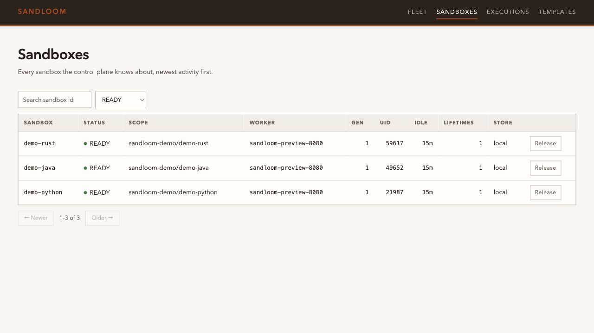

# Admin console


This is a real local Docker deployment with demo workspaces, not a mockup.
The API token is never included in the screenshot.

Every operational API answers a question about a sandbox whose id you already
have. An operator starts without one. The first question is *what is running,
and where*; the second is *why is that one stuck*. The console and the
`/api/v1/admin/*` routes exist to answer those two.

Open `http://<host>:8080/admin`, paste the value of `SANDBOX_INTERNAL_TOKEN`,
and press **Connect**.

```bash
docker compose up -d
echo "$SANDBOX_INTERNAL_TOKEN"   # paste this into the console
open http://127.0.0.1:8080/admin
```

## What it shows

| View | Answers |
| --- | --- |
| **Fleet** | Capacity, sandbox counts, reclamation periods, worker heartbeats/profiles, isolation probe failures, effective additive capabilities and measured toolchain launches |
| **Sandboxes** | Every route the control plane knows, filterable by status, scope, worker, or id substring; releases one |
| **Executions** | Recorded commands newest-first, with exit code, scope, and duration; opens one to read its output. The audit window is 15 days, after which a record is pruned |
| **Templates** | Published environment templates, with digest, size, mount target, and origin; unpublishes one |

Several things on the Fleet view are worth calling out.

**Capacity counts live workers only.** A worker row survives in SQL after the
process dies, but it is not somewhere a new sandbox can actually be placed, so
a stale row contributes nothing to the total. The `Workers live` readout shows
`live / total`, and the gap between those numbers is the signal.

**Profiles decide where a sandbox can go.** A replica places a sandbox only on a
worker whose `SANDBOX_PROFILE_HASH` matches its own, so a fleet that is half
rebuilt in place shows two groups of rows that are otherwise identical — all
live, all beating, all with spare capacity — and neither group will accept the
other's sandboxes. The hash is rendered whole rather than truncated like the
digests on the Templates view: two of them can agree for twenty characters and
still describe different sandboxes, and `bubblewrap-0.11.2-generic-v12-basic-net-host`
against `bubblewrap-0.11.2-generic-v12-other-basic-net-host` is that case.

**Reclamation shows the periods this replica is actually running.** The
question behind every idle sandbox on the page is when it will be taken back,
and the answer is two numbers: how long a route may sit untouched, and how often
the sweep runs. They come from the replica that answered, like the isolation
level and the disk figures beside them, so a fleet started with shortened
periods for a test shows the shortened ones rather than the shipped defaults —
which is what makes the readout evidence rather than decoration.

**Isolation probe failures are shown verbatim.** If this host reports `basic`
rather than `strict`, the table gives the `bwrap` stderr that caused each level
to be rejected. That is almost always a container policy question rather than a
bug — see [Isolation](ISOLATION.md).

**Capability and language checks are separate.** The selected Level, any
required/optional additions, skipped additions and toolchain results are shown
independently. A tool launch marked available does not claim that every build
framework works, or that cgroup namespaces enforce aggregate quotas. Use
[Environment diagnosis](ENVIRONMENT_DIAGNOSTICS.md) before adapting a worker.

## Design constraints



These Python, Java and Rust workspaces ran real commands in a local
`basic + cgroup_namespace` deployment. The optional PID namespace was
unavailable in that container and was reported as skipped, not silently enabled.

**No build step, no CDN, no npm.** The console is one self-contained HTML
document served from `agent_sandbox.console`. An operator console is exactly
what you need when a cluster is misbehaving, which is also when a locked-down
or air-gapped network is least willing to fetch a font or a framework from the
internet. So the page uses a system font stack and vanilla JavaScript. It also
means the console cannot drift out of sync with the API version that ships it,
and that installing the package is the whole installation.

**The page is served unauthenticated; the data is not.** `GET /admin` returns
only static markup. Every API call the page makes carries the token, which is
held in `sessionStorage` for that tab alone. Requiring auth on the page itself
would mean putting the token in a URL or a cookie, and both are worse.

**Read-mostly.** The only mutations are releasing a sandbox and unpublishing a
template, and both already exist as supported API operations. The console gains
no privileged path the API does not already have.

**Destructive actions ask in the page, not with a host dialog.** Both of those
actions need a second click: the button reads "Confirm release" or "Confirm
unpublish" and disarms itself if the click is not followed up. The obvious
implementation is `window.confirm`, and it is the wrong one — an embedded web
view answers it with `false` immediately, without showing a dialog and without
an error, so the button does nothing and says nothing. The console is embedded in
exactly such a view by the tooling this project is tested with; both buttons were
dead there before this, and the API-call tests could not tell.

## API

All routes require `Authorization: Bearer $SANDBOX_INTERNAL_TOKEN`.

| Route | Purpose |
| --- | --- |
| `GET /api/v1/admin/overview` | Status histogram, worker list, capacity, isolation, disk |
| `GET /api/v1/admin/sandboxes` | Paged routes; `status`, `workspace_scope_id`, `worker_id`, `search`, `limit`, `offset` |
| `GET /api/v1/admin/execs` | Paged executions; `sandbox_id`, `status`, `exec_scope`, `limit`, `offset` |
| `GET /api/v1/admin/execs/{sandbox_id}/{exec_id}` | One recorded execution with its `stdout`/`stderr`, readable after the sandbox is released |
| `GET /admin` | The console page itself |

The two buttons call the routes an ordinary client calls, rather than an admin
copy of them, so there is one implementation of each action:

| Route | Purpose |
| --- | --- |
| `DELETE /api/v1/sandboxes/{id}` | Release, as **Confirm release** does; deletes the workspace |
| `DELETE /api/v1/templates/{name}` | Unpublish, as **Confirm unpublish** does; the revision stays in the store |

Confirming is a property of the page, not of the API: a `DELETE` sent directly
takes effect on the first call, with no second one to wait for.

```bash
TOKEN=$SANDBOX_INTERNAL_TOKEN

# What is idle and reclaimable?
curl -s -H "Authorization: Bearer $TOKEN" \
  'http://127.0.0.1:8080/api/v1/admin/sandboxes?status=READY&limit=50'

# What failed recently?
curl -s -H "Authorization: Bearer $TOKEN" \
  'http://127.0.0.1:8080/api/v1/admin/execs?status=FAILED'
```

`limit` is capped at 200. A request above the cap is rejected with `422` rather
than silently clamped, so a script never believes it received a full page.

`search` matches a substring of `sandbox_id` with `LIKE` wildcards escaped:
`search=%` matches sandboxes whose id literally contains a percent sign, not
every sandbox in the fleet.

Listings deliberately omit `stdout`/`stderr`; inlining them would make a page
of executions unusable. **Read** on a row fetches that one execution, and the
route behind it is
`GET /api/v1/admin/execs/{sandbox_id}/{exec_id}`.
Execution IDs are scoped to a sandbox, so separate sandboxes may each have an
execution named `hello` without sharing the output panel's selection state.

The sandbox route answers the same question for a *live* sandbox —
`GET /api/v1/sandboxes/{id}/exec/{exec_id}` validates the current route, which
is what a client polling its own command needs. It refuses a released sandbox
with `409 STALE_SANDBOX_ROUTE`, and every sandbox is eventually released, so the
console does not use it: an operator reading about a failure usually arrives
after the sandbox that produced it is gone. The admin route reads the recorded
row instead, which is what an audit is.

## Fleet queries are an optional capability

These routes need queries no other part of the system does: list routes without
knowing an id, group them by status, and enumerate workers. Rather than widen
the `MetadataStore` protocol — which would break every third-party metadata
plugin on upgrade — they are a separate, narrowable capability:

```python
from agent_sandbox.storage import as_fleet_queries

fleet = as_fleet_queries(database)   # None when the store lacks the methods
```

The bundled SQL store implements them. A plugin store that predates them keeps
working, and the console degrades honestly:

| Situation | Behavior |
| --- | --- |
| Store implements fleet queries | Full console |
| Store does not | `501 SANDBOX_FLEET_QUERIES_UNSUPPORTED` on listings; overview still returns worker and capacity data with `fleet_queries_available: false` |

Returning an empty list in that case would be worse than an error, because an
empty fleet and an unsupported store look identical to the operator.

## Notes

The overview refreshes every 15 seconds, and only while the Fleet view is
visible and the tab is focused. Reloading under an operator who is typing a
filter or reading a row is worse than showing data a few seconds old.

Releasing a sandbox deletes its workspace and cannot be undone. A released row
shows no idle time and offers no action, because there is nothing left to act
on.

The console is served by whichever worker you point your browser at, but the
data is fleet-wide: it comes from the shared control-plane database, not from
that worker's local state. Any worker gives the same answer.

One figure is the exception, and it says so. The **Templates** count is read
from the catalog of the worker being asked, and without an object store a
template exists only on the worker that published it — so on a multi-worker
install that count describes that worker while every other number on the page
describes the fleet. The overview reports whether a shared store is configured,
and the label under the number reads `fleet-wide` or `this worker only`
accordingly. See [Templates](TEMPLATES.md) for why the store is what makes a
template cross workers.
