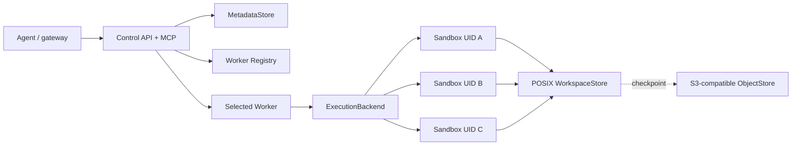

# Architecture

## Goal

The service minimizes per-agent compute overhead by multiplexing many isolated
workspaces inside one trusted worker container. It separates durable control
state from ephemeral command processes and prevents old worker assignments
from continuing to write after failover.

## Components

- The control API owns route allocation and generation fencing.
- The metadata store is authoritative for routes, executions, and audit data.
- The worker registry is a TTL-based availability and load index, not an
  authoritative database.
- The execution backend creates short-lived isolated processes over a stable
  workspace.
- The workspace is local or shared POSIX storage. The object store holds
  environment templates, any checkpoint archives a caller puts there, and the
  snapshot of a suspended sandbox, which is the only workspace the service
  itself archives and restores ([Suspend and resume](SUSPEND_RESUME.md)).

## Sandbox lifecycle

1. `resolve` creates or finds the authoritative route.
2. A worker creates top-level directories once and verifies their UID on
   recovery without recursively walking large dependency trees.
3. Every `exec` obtains a workspace lock, creates a fresh Bubblewrap process,
   and persists an idempotency record.
4. The route moves through `ASSIGNED`, `READY`, `RUNNING`, `RELEASING`, and
   `RELEASED` states using compare-and-set updates. An idle `READY` route can
   also be parked as `SUSPENDING`/`SUSPENDED`, which releases its capacity slot
   and keeps its workspace until a resume; see
   [Suspend and resume](SUSPEND_RESUME.md).
5. Reassignment increments `generation`. Stale generations are rejected at
   both the control API and worker API.

### Reclamation

Nothing is left to a human to clean up. Every worker runs a maintenance cycle
(`SANDBOX_MAINTENANCE_INTERVAL_SECONDS`, 60s by default) that reclaims the two
ways a sandbox is abandoned, and both were verified against a running service.
The same cycle enforces the template cache budget
(`SANDBOX_TEMPLATE_CACHE_MAX_BYTES`, unbounded by default): cached environments
are the largest thing a worker writes to disk, and a revision bound to a live
sandbox is pinned rather than evicted:

- **Idle.** A route untouched for longer than `SANDBOX_IDLE_TTL_SECONDS` is
  released with reason `IDLE_TIMEOUT` and its workspace is deleted. The next
  call naming it is answered `409 STALE_SANDBOX_ROUTE`, not a hang and not a
  success against a directory that is no longer there.
- **Worker loss during an execution.** A route in `RUNNING` whose owning worker
  is gone from the registry, or is back with a different epoch, is released
  after `SANDBOX_ORPHAN_RUNNING_GRACE_SECONDS` with reason `WORKER_LOST`, and
  its execution record is marked `WORKER_LOST` with it. The generation advances,
  so the replacement worker — and any client still holding the old generation —
  cannot mistake the reclaimed sandbox for the one that was running.
- **Suspended past retention.** A route suspended for longer than
  `SANDBOX_SUSPENDED_RETENTION_SECONDS` (30 days by default) is released
  with reason `SUSPEND_EXPIRED`, deleting its directory and snapshot. Under
  disk pressure the same cycle first drops local copies of suspended sandboxes
  that have a snapshot. See [Suspend and resume](SUSPEND_RESUME.md).
- **Directories a worker no longer owns.** A local workspace directory whose
  route is released or names another worker (a resume landed elsewhere) is
  deleted by its worker after `SANDBOX_ORPHAN_DORMANT_DIR_TTL_SECONDS`
  (24 hours by default), timed by a marker on disk so a restart keeps the clock.

A client that was waiting on the execution sees its connection to that worker
drop. That is not recoverable at the point of failure: the guarantee is that
the fleet converges, not that the lost request is answered. A client that needs
the work done re-sends it against the new generation, and the workspace it
finds is the last one the dead worker committed.

Reclamation failures do not stop the cycle: they are counted in
`reaper_status.failures_total` and retried on the next one. A route a client
released first is not one of them — the sweep loses that race routinely, the
sandbox is gone either way, and `already_gone_total` counts it separately
rather than putting a traceback in the log for work that was already done.
`GET /healthz`
publishes the whole record under `worker.orphan_reaper`, beside the periods it
is running with under `worker.reclamation` — what it has reclaimed, and how
long it waits before it does, which is what makes a fleet verifiable as the one
it was started as rather than as the one this release defaults to.

## Adapter boundaries

The generic service depends on stable behavior, not concrete products:

- `MetadataStore`: route and execution transactions.
- `Registry`: worker heartbeat, lookup, and load-based selection.
- `ObjectStore`: archive storage — the environment templates this project
  moves, and the checkpoint objects a caller manages.
- `ExecutionBackend`: environment probe and sandbox execution lifecycle.

The built-in public SQL adapter uses portable SQLAlchemy tables and supports
SQLite, MySQL, and PostgreSQL. Enterprise discovery, credential, storage, and
runtime integrations are never compiled into the public package; a private
distribution registers them through Python entry points.

All third-party backends are loaded only when explicitly named. Missing or
ambiguous plugins fail startup, so an enterprise deployment cannot silently
fall back to an incompatible public backend.

## Relationship to Cloudflare Computer

[Cloudflare Computer](https://blog.cloudflare.com/cloudflare-computer/) and
Agent Sandbox share four architectural ideas:

1. An agent should see a stable computer/workspace, not a sequence of unrelated
   containers.
2. Storage and execution should be separate contracts.
3. Expensive container execution should be used only when a task needs it.
4. File and command operations should be controlled, observable, and audited.

Cloudflare Computer currently uses a SQLite-backed virtual filesystem, runs
cheap operations in Workers isolates, and mounts that filesystem into a Linux
container through FUSE for heavier operations. It exposes one `exec` interface
whose backend can be selected per task.

This project begins one layer lower: a Linux worker container is already
allocated, and many Bubblewrap sandboxes share its toolchain. Workspaces are
ordinary POSIX directories, which keeps native build tools fast and preserves
existing application behavior. The trade-off is that a local workspace is
coupled to its worker unless an external snapshot or shared RWX filesystem is
used.

The execution-backend SPI is the intentional convergence point. A future
isolate/WASM backend can handle file transforms and simple scripts against the
same logical workspace, while Bubblewrap or a microVM handles native binaries.
Backend selection must remain policy-controlled and observable; model hints
may choose among allowed backends but cannot raise isolation privileges.

## Placement

`resolve` picks the worker with the fewest sessions, using the load each worker
last reported in its heartbeat. The value is therefore up to one
`heartbeat_interval_seconds` old (10s by default), which has a visible
consequence worth knowing before it is mistaken for a bug: a burst of `resolve`
calls inside one interval all see the same numbers and land on the same worker,
even with an idle worker beside it. Measured with two workers, twelve seconds
apart: `a, b, a, b, a, b`. Start-up bursts that matter should be paced, or
`heartbeat_interval_seconds` lowered.

Schema creation is the other multi-replica concern. With
`SANDBOX_DATABASE_AUTO_DDL=true`, replicas starting together would both see a
missing table and both create it, and the loser exits on a duplicate-key error
from the system catalog — so a rolling update or `compose up --scale` crash-loops
until one of them wins. The schema is now created under a database advisory
lock (PostgreSQL `pg_advisory_lock`, MySQL `GET_LOCK`), which makes the check
and the create one step. SQLite needs none: it is one file in one process.

Creation is not the only schema concern. `create_all` creates missing tables and
never alters one that already exists, and `CREATE TABLE IF NOT EXISTS` — what the
shipped `deploy/sql/*.sql` is built from — is skipped whole for a table that is
already there. So a column added in a release reaches a managed database only if
someone applies the `ALTER`; re-applying the file changes nothing. Startup
therefore compares the live schema with the one this build writes and refuses to
serve when anything is missing, because the alternative is finding out from a
`no such column` on whichever request first touches that column. Columns the
build does not write are logged and tolerated instead: those mean a rollback, and
a rollback has to stay possible.

## Consistency model

- The SQL metadata store is authoritative.
- Registry records expire and may be stale; every write is fenced by database
  generation and worker epoch. A worker that dies keeps its record for
  `SANDBOX_HEARTBEAT_TTL_SECONDS` (30s by default), and until it expires
  placement can still choose it — `resolve` succeeds and the following call is
  answered `SANDBOX_WORKER_UNREACHABLE`. That window is expected rather than a
  fault, and it is the reason placement is not the thing that keeps a lost
  sandbox from being used: the generation check is.

  Verified with two workers over one shared workspace and one PostgreSQL: a
  sandbox created on one worker kept its files when that worker was killed, and
  the replacement worker served them under generation 2 while generation 1 was
  refused.
- A shared POSIX workspace has one logical writer. An advisory filesystem lock
  protects the failover overlap window.
- Local storage failover preserves the logical sandbox ID but not physical
  files. Callers needing recovery must restore from a checkpoint; a suspended
  sandbox with a snapshot is the exception, and resumes on another worker.

## Non-goals

- A Docker/Kubernetes replacement.
- A VM-equivalent hostile-code boundary.
- Transparent live migration of running processes.
- Shared writable dependency caches across tenants.
